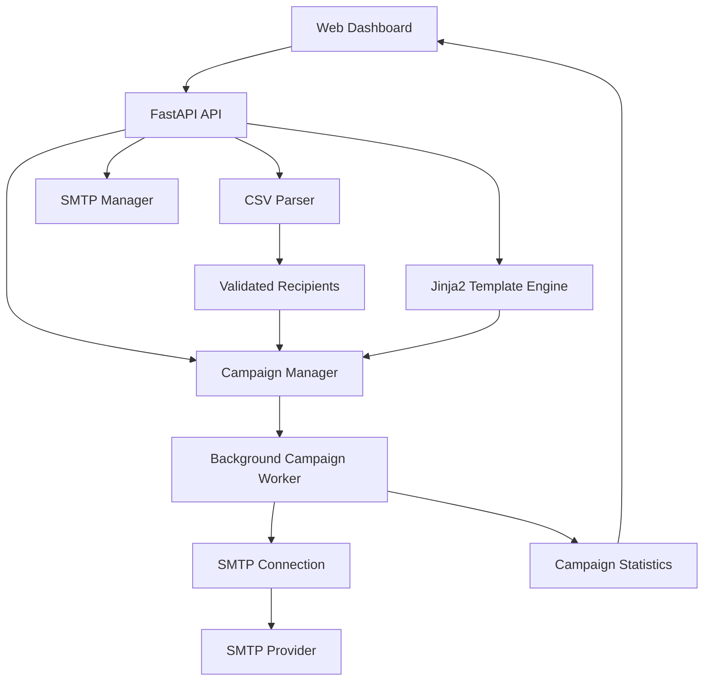

<div align="center">


[](https://fastapi.tiangolo.com)
[](https://www.python.org)
[](https://jinja.palletsprojects.com/)
[](https://www.rfc-editor.org/rfc/rfc5321)

> 📧 A modern and reliable SMTP email campaign manager built with Python and FastAPI.

<p align="center">
  <a href="#features">Features</a> •
  <a href="#prerequisites">Prerequisites</a> •
  <a href="#installation">Installation</a> •
  <a href="#usage">Usage</a> •
  <a href="#architecture">Architecture</a> •
  <a href="#security">Security</a>
</p>

<p align="center">
 Campaign Management
 HTML Templates
 Live Progress
</p>

</div>

---

## ✨ Features

<details>
<summary>📧 Email Campaign Management</summary>

* **Campaign Dashboard**

  * Create and monitor email campaigns
  * Real-time sending progress
  * Sent and failed email counters
  * Campaign status tracking
  * Stop active campaigns

* **SMTP Integration**

  * Custom SMTP host and port
  * TLS / SSL support
  * SMTP authentication
  * Connection testing
  * Session-based SMTP configuration

* **Background Sending**

  * Non-blocking campaign processing
  * Persistent SMTP connection during a campaign
  * Configurable delay between emails
  * Automatic retry mechanism
  * Graceful campaign stopping

</details>

<details>
<summary>📋 Recipient Management</summary>

* **CSV Upload**

  * Upload recipient lists using CSV files
  * UTF-8 CSV support
  * Automatic email column detection
  * CSV size validation

* **Data Validation**

  * Email format validation
  * Invalid email detection
  * Duplicate email removal
  * Clean and normalized recipient data

* **CSV Preview**

  * Preview imported contacts
  * Display available recipient fields
  * Review valid and invalid records before sending

</details>

<details>
<summary>📝 HTML Email Templates</summary>

* **HTML Email Editor**

  * Create custom HTML email content
  * Write responsive email templates
  * Live email preview

* **Personalization**

  * Dynamic Jinja2 variables
  * Personalized subject lines
  * Personalized HTML content

Example:

```html
<h1>Hello {{ name }}</h1>

<p>
Welcome to {{ company }}.
</p>

<p>
We are happy to have you with us.
</p>
```

Each recipient receives a personalized version of the message based on the CSV data.

</details>

<details>
<summary>🔄 Reliability & Error Handling</summary>

* Automatic retry for failed emails
* Configurable sending interval
* Per-recipient error tracking
* Campaign-level error handling
* Graceful SMTP connection cleanup
* Detailed campaign status
* Safe background processing

</details>

---

## 🚀 How MailFlow Works

```mermaid
graph LR
    A[Upload CSV] --> B[Validate Recipients]
    B --> C[Configure SMTP]
    C --> D[Test Connection]
    D --> E[Create HTML Template]
    E --> F[Preview Email]
    F --> G[Create Campaign]
    G --> H[Background Worker]
    H --> I[SMTP Server]
    I --> J[Track Progress]
    J --> K[Campaign Report]
```



---

## 📋 Prerequisites

<table align="center">
  <tr>
    <td align="center" width="120">
      
      <br><b>Python 3.10+</b>
    </td>
    <td align="center" width="120">
      
      <br><b>FastAPI</b>
    </td>
    <td align="center" width="120">
      
      <br><b>Jinja2</b>
    </td>
  </tr>
</table>

You will also need access to an SMTP provider such as Gmail, Outlook, or another SMTP service.

---

## 🛠️ Installation

### 1️⃣ Clone the Repository

```bash
git clone https://github.com/your-username/MailFlow.git
cd MailFlow
```

### 2️⃣ Create a Virtual Environment

#### Windows

```bash
python -m venv venv
venv\Scripts\activate
```

#### macOS / Linux

```bash
python3 -m venv venv
source venv/bin/activate
```

### 3️⃣ Install Dependencies

```bash
pip install -r requirements.txt
```

### 4️⃣ Start MailFlow

```bash
python app.py
```

The application will be available at:

```text
http://localhost:8000
```

---

## 💻 Usage

### 📤 1. Configure SMTP

Open MailFlow and configure your SMTP settings:

```text
SMTP Host
SMTP Port
Username
Password
Security
```

Supported security modes:

```text
TLS
SSL
None
```

For example, a typical TLS configuration may look like:

```text
Host: smtp.gmail.com
Port: 587
Security: TLS
```

> ⚠️ SMTP providers may require an App Password or specific authentication settings. Do not use your primary account password when the provider requires an App Password.

---

### 📋 2. Upload Your CSV

Your CSV file should contain an `Email` column.

Example:

```csv
Email,name,company,city
john@example.com,John Doe,ABC Company,Cairo
jane@example.com,Jane Smith,XYZ Company,Giza
```

MailFlow automatically:

* Detects the email column
* Validates email addresses
* Removes duplicates
* Ignores invalid records
* Displays the imported data before sending

---

### 📝 3. Create Your Email

Write your HTML email template using Jinja2 variables.

Example:

```html
<!DOCTYPE html>
<html>
<body>

<h1>Hello {{ name }}!</h1>

<p>
Welcome to {{ company }}.
</p>

<p>
We are excited to connect with you in {{ city }}.
</p>

</body>
</html>
```

MailFlow generates a personalized email for every recipient.

---

### 👀 4. Preview Your Email

Before sending your campaign, review the HTML content and verify that your personalization variables are correct.

Example:

```text
{{ name }}
{{ company }}
{{ city }}
```

---

### 🚀 5. Start the Campaign

After validating your SMTP configuration and recipient list, start the campaign.

MailFlow processes the campaign in the background and displays:

```text
Campaign Status
───────────────
Sending...

Processed: 45 / 100
Sent:      43
Failed:     2

Progress: 45%
```

You can also stop an active campaign when necessary.

---

## 🔄 Retry System

MailFlow automatically retries failed email deliveries.

The default configuration uses:

```text
Retry Attempts: 3
```

A simplified flow:

```text
Send Email
    ↓
Success?
 ┌──┴──┐
Yes    No
 ↓      ↓
Done   Retry
        ↓
     Retry 2
        ↓
     Retry 3
        ↓
     Failed
```

Failed recipients and their error messages are stored in the campaign result.

---

## 📊 Campaign Status

Each campaign can have one of the following statuses:

```text
pending
sending
completed
stopped
failed
```

Campaign statistics include:

* Total recipients
* Processed recipients
* Successfully sent emails
* Failed emails
* Error details
* Last update timestamp

---

## 🛡️ Security

MailFlow was designed with several security improvements over the original implementation.

### 🔐 SMTP Credentials

SMTP passwords are kept in application memory and are **not written to application logs**.

The application does not expose the password through the SMTP status endpoint.

### 📄 CSV Validation

CSV files are validated before processing.

Current protection includes:

* UTF-8 validation
* Maximum CSV size limit
* Required email column
* Email syntax validation
* Duplicate detection

The current maximum CSV size is:

```text
5 MB
```

### 🧹 Safe Logging

Sensitive SMTP credentials are intentionally excluded from logging.

Campaign logs contain operational information such as:

```text
Campaign ID
Campaign status
Sent count
Failed count
```

but not SMTP passwords.

---

## 🏗️ Architecture



---

## 📁 Project Structure

```text
MailFlow/
│
├── app.py
├── requirements.txt
├── .env.example
├── .gitignore
├── README.md
├── LICENSE
│
├── Frontend/
│   └── index.html
│
├── static/
│
└── assets/
    ├── favicon-16x16.png
    ├── favicon-32x32.png
    └── favicon-96x96.png
```

### Main Components

| Component             | Responsibility                     |
| --------------------- | ---------------------------------- |
| `app.py`              | FastAPI backend and campaign logic |
| `Frontend/index.html` | MailFlow dashboard                 |
| `requirements.txt`    | Python dependencies                |
| `.env.example`        | Environment configuration example  |
| `assets/`             | Application assets                 |
| `static/`             | Static application resources       |

---

## 🔧 Configuration

### Campaign Settings

MailFlow currently supports configurable:

* SMTP host
* SMTP port
* SMTP security
* SMTP username
* SMTP password
* Sender name
* Email subject
* HTML content
* Sending interval
* Retry attempts

Default sending interval:

```text
1 second
```

Default retry attempts:

```text
3 attempts
```

---

## 🔌 API Overview

MailFlow exposes API endpoints for the dashboard and campaign management.

Health check:

```http
GET /api/health
```

SMTP status:

```http
GET /api/smtp/status
```

SMTP configuration:

```http
POST /api/smtp/configure
```

The campaign API is responsible for:

* Creating campaigns
* Starting background sending
* Reporting progress
* Stopping active campaigns
* Returning campaign results

---

## ⚡ Performance

MailFlow uses asynchronous processing to prevent long-running email campaigns from blocking the web application.

The sending process uses:

```text
FastAPI
   ↓
Async Campaign Worker
   ↓
asyncio.to_thread()
   ↓
SMTP Operations
```

This allows the web interface to remain responsive while a campaign is running.

A persistent SMTP connection is also reused during a campaign instead of creating a new connection for every email.

---

## 🚧 Current Limitations

MailFlow V1 intentionally keeps the architecture lightweight.

Currently:

* Campaign data is stored in memory.
* SMTP configuration is session-based.
* Campaign history is lost when the application restarts.
* There is no user authentication yet.
* There is no persistent database yet.
* Scheduling is not included in the current version.
* Advanced delivery/open/click tracking is not included.

These limitations are planned areas for future versions.

---

## 🗺️ Roadmap

### Version 1.0

* [x] FastAPI backend
* [x] Modern dashboard
* [x] SMTP configuration
* [x] SMTP connection testing
* [x] CSV upload
* [x] Email validation
* [x] Duplicate detection
* [x] HTML templates
* [x] Jinja2 personalization
* [x] Background sending
* [x] Retry mechanism
* [x] Live campaign progress
* [x] Stop campaign
* [x] Error tracking

### Version 2.0

* [ ] SQLite / PostgreSQL database
* [ ] Persistent campaign history
* [ ] Saved email templates
* [ ] User authentication
* [ ] Campaign scheduling
* [ ] Contact management
* [ ] Multiple campaigns
* [ ] Better email analytics
* [ ] Open and click tracking
* [ ] Improved queue management
* [ ] Production deployment configuration

### Version 3.0

* [ ] Redis-based task queue
* [ ] Celery / distributed workers
* [ ] Multi-user accounts
* [ ] Role-based permissions
* [ ] Advanced analytics
* [ ] Email provider integrations
* [ ] Campaign automation
* [ ] Production-grade monitoring

---

## 🤝 Contributing

Contributions are welcome.

If you would like to improve MailFlow:

1. Fork the repository
2. Create a feature branch

```bash
git checkout -b feature/my-new-feature
```

3. Commit your changes

```bash
git commit -m "Add new feature"
```

4. Push the branch

```bash
git push origin feature/my-new-feature
```

5. Open a Pull Request

---

## 📄 License

<div align="center">

MIT License © MailFlow Contributors

MailFlow is provided as an open-source project for learning, development, and legitimate email communication use cases.


</div>
